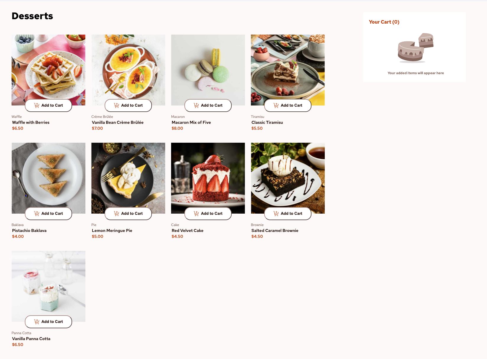
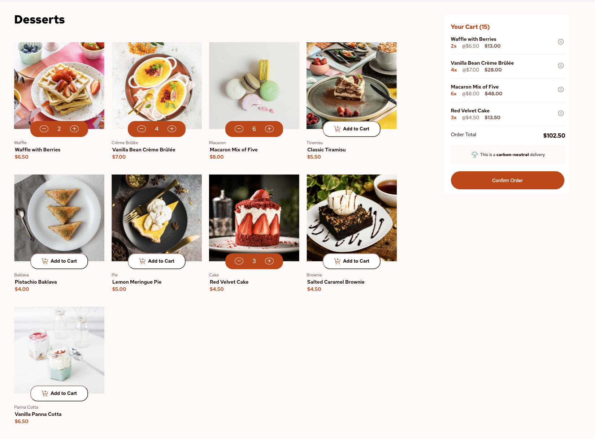
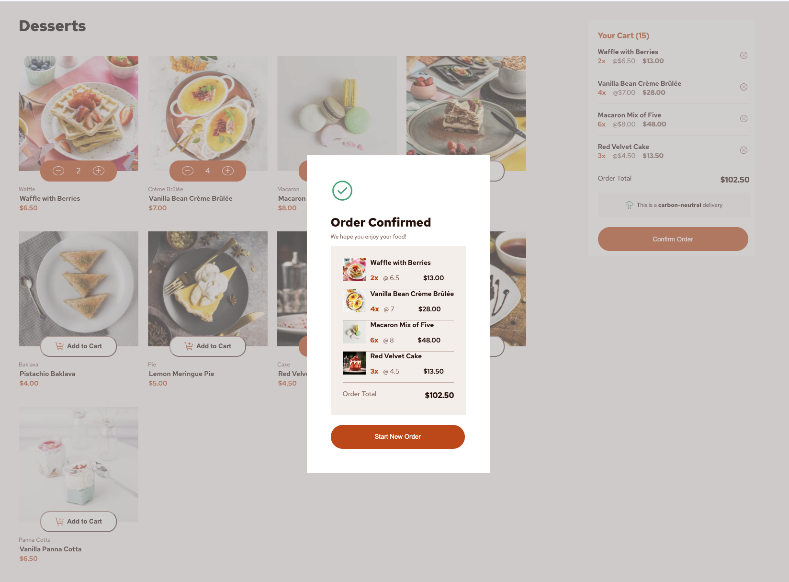

# ProductListApp

- This project was generated using [Angular CLI](https://github.com/angular/angular-cli) version 19.1.6.
- Exploring Signals and Services.
- Desktop only version

## Built with

- Semantic HTML5 markup
- CSS custom properties
- Flexbox
- Typescript
- Angular

## Screenshots





## Signals

- In CartService as cartItems to manage CartItems. Computed signals for total, cart count.
- In CartItemComponent as item to set inoput cartItem as signal. Also, as computed signal for extended prices.

## Services

- Dummy dessert service to populate UI from json.
- Cart Service to manage cart Items.

## Running the app

Install dependencies and run:

```bash
npm install
ng serve
```
